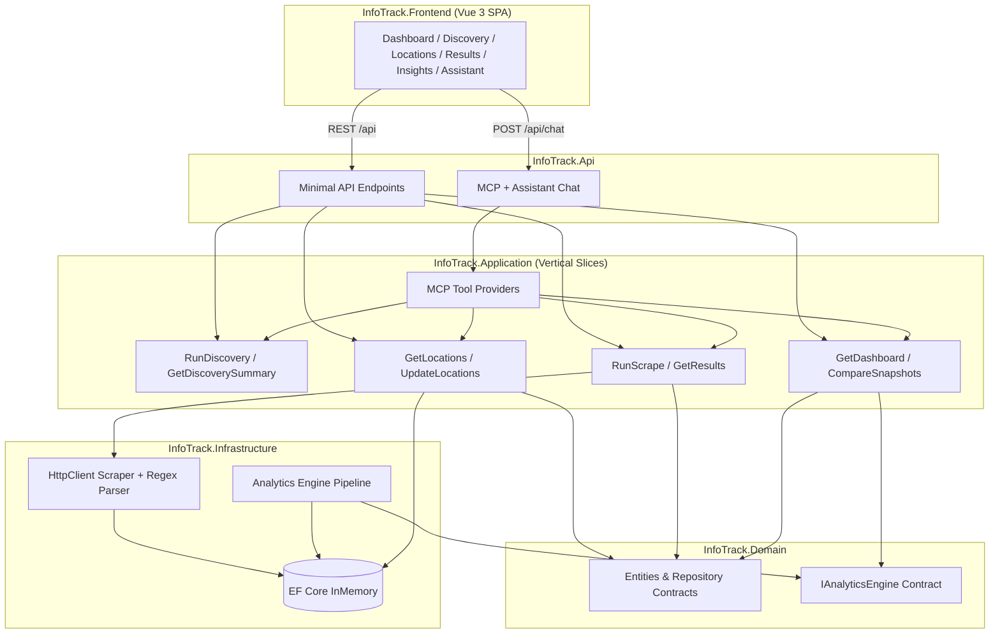

# InfoTrack Solicitor Intelligence Platform

Technical assessment solution demonstrating production-grade .NET architecture, a Vue 3 executive dashboard, and an intentionally overengineered analytics engine designed for future microservice extraction.

## Architecture



### Clean Architecture + Vertical Slices

| Layer                        | Responsibility                                                                    |
| ---------------------------- | --------------------------------------------------------------------------------- |
| **InfoTrack.Domain**         | Entities, repository interfaces, analytics contracts, scraping abstractions       |
| **InfoTrack.Application**    | Feature handlers (`Features/Locations`, `Features/Scraping`, `Features/Insights`) |
| **InfoTrack.Infrastructure** | EF Core, HTTP scraping, regex HTML parser, analytics pipeline                     |
| **InfoTrack.Contracts**      | Shared API DTOs (records)                                                         |
| **InfoTrack.Api**            | Composition root, Swagger, CORS, ProblemDetails                                   |
| **InfoTrack.Frontend**       | Vue 3 + TypeScript executive dashboard                                            |
| **InfoTrack.Tests**          | Parser, analytics, and integration tests                                          |

Dependencies flow inward: Api → Application → Domain. Infrastructure implements Domain abstractions.

## Project structure

```
InfoTrack/
├── InfoTrack.sln
├── InfoTrack.Api/              # ASP.NET Core Web API host
│   ├── Assistant/              # SPA chat endpoint + local LLM client
│   └── Mcp/                    # JSON-RPC MCP server + tool listing
├── InfoTrack.Application/      # Vertical slice handlers
│   └── Features/
│       ├── Discovery/
│       ├── Locations/
│       ├── Scraping/
│       ├── Insights/
│       └── Mcp/                # Tool providers for MCP + assistant
├── InfoTrack.Domain/           # Core domain model
├── InfoTrack.Infrastructure/   # EF Core, scraper, sitemap discovery, analytics engine
├── InfoTrack.Contracts/        # REST DTOs
├── InfoTrack.Frontend/         # Vue 3 SPA (onboarding tour, header history UI)
└── InfoTrack.Tests/            # xUnit + FluentAssertions
```

## How to run

### Prerequisites

- [.NET 10 SDK](https://dotnet.microsoft.com/download)
- [Node.js 20+](https://nodejs.org/)

### Backend

```bash
cd InfoTrack
dotnet run --project InfoTrack.Api
```

API: http://localhost:5080  
Swagger: http://localhost:5080/swagger

### Frontend

```bash
cd InfoTrack/InfoTrack.Frontend
npm install
npm run dev
```

SPA: http://localhost:5173 (proxies `/api` to the backend)

### Tests

```bash
cd InfoTrack
dotnet test
```

## API endpoints

| Method | Route                        | Description                                              |
| ------ | ---------------------------- | -------------------------------------------------------- |
| GET    | `/api/locations`             | List configured scrape locations                         |
| POST   | `/api/locations`             | Replace location list `{ "locations": ["London", ...] }` |
| POST   | `/api/discovery/run`         | Discover locations from sitemap and sync catalogue       |
| GET    | `/api/discovery/summary`     | Discovery summary and historical trend                   |
| GET    | `/api/discovery/runs/latest` | Most recent completed discovery run                      |
| GET    | `/api/discovery/runs`        | Discovery run history                                    |
| POST   | `/api/scrape`                | Scrape all active locations and generate analytics       |
| GET    | `/api/results`               | Latest solicitor listings grouped by location            |
| GET    | `/api/insights`              | Executive dashboard summary                              |
| GET    | `/api/insights/compare`      | Snapshot delta comparison                                |
| POST   | `/api/chat`                  | Natural-language assistant (local LLM + MCP tools)       |
| GET    | `/api/mcp/tools`             | List MCP tool definitions (API key required)             |
| POST   | `/api/mcp/assistant`         | MCP-aware assistant endpoint (API key required)            |
| POST   | `/api/mcp`                   | MCP JSON-RPC endpoint (API key required)                 |

## Technology choices

| Area        | Choice                                               | Rationale                                                                         |
| ----------- | ---------------------------------------------------- | --------------------------------------------------------------------------------- |
| Runtime     | **.NET 10**                                          | Latest LTS-track release; modern C# features, performance, first-class DI/logging |
| Persistence | **EF Core InMemory**                                 | Zero-configuration assessment setup; swappable for SQL Server in production       |
| API         | **Minimal APIs + Swagger + ProblemDetails**          | Lean, readable endpoints with OpenAPI and RFC 7807 errors                         |
| Frontend    | **Vue 3 + Vite + Pinia + Chart.js**                  | Matches job spec; fast DX; professional dashboard charts                          |
| Assistant   | **Local OpenAI-compatible LLM + MCP tool calling**   | Structured natural-language access to live InfoTrack data                         |
| Scraping    | **HttpClient + Regex + string ops**                  | Assessment constraint; demonstrates deliberate parsing logic                      |
| Testing     | **xUnit + FluentAssertions + WebApplicationFactory** | Industry-standard .NET testing stack                                              |

### Why .NET 10?

.NET 10 is the current platform for greenfield services at scale: improved JIT performance, unified SDK tooling, mature minimal hosting model, and alignment with InfoTrack's existing C# / ASP.NET Core stack. Using the latest stable release signals modern engineering practice without experimental risk.

## How the scraper works

InfoTrack mirrors the successful [solicitors.com](https://www.solicitors.com/) conveyancing search path without driving the browser form:

1. **Site search flow (reference)**: The homepage form posts to `/prepare-search.asp` with area-of-law (`did=192` for Conveyancing) and a location string. Partial location keystrokes call `/scripts/locations.asp?ajax=1&q=…` for autocomplete; an empty or unmatched location falls back to the generic [`/conveyancing.html`](https://www.solicitors.com/conveyancing.html) hub (informational content, no ranked listings). A resolved location such as London loads [`/conveyancing+london.html`](https://www.solicitors.com/conveyancing+london.html) with `.result-item` / `.result-item.item-small` solicitor cards.

2. **Direct fetch**: Configured locations are normalised to lowercase slugs (`London` → `london`) and fetched from `/conveyancing+{location}.html` via typed `HttpClient` (`ISolicitorsScrapeClient`), with configurable delay and User-Agent.

3. **Parse**: `SolicitorsHtmlParser` extracts each `<div class="result-item">` block (including `item-small` variants) and reads:
   - Firm name from `<span class="h2">` (stopping before quality-mark or review markup)
   - Phone from `tel:` anchors (full cards and compact `item-small` rows)
   - Address from `<address>`
   - Website / email enquiry links by locating `fa-globe` / `fa-envelope` icons within their parent `<a>` tags
   - Star ratings from `star-full` / `star-half` / `star-none` CSS classes
   - Review counts from `(123)` patterns

4. **Persist**: Solicitors are upserted by stable `ExternalKey` (SHA-256 of name + address + phone). Each scrape creates an immutable `ScrapeSnapshot` with ranked entries.

5. **Analytics**: The analytics engine compares the new snapshot to the previous one and persists an `InsightSummary`.

No HtmlAgilityPack or AngleSharp is used — parsing is intentionally manual.

## Intentionally overengineered: Analytics Engine

The **Analytics Engine** is the deliberate "show-off" component, structured as an extractable microservice:

```
IAnalyticsEngine
├── SnapshotComparer        → new/removed solicitor detection, regional deltas
├── RankingEngine           → national leaderboard, rank change tracking
├── RegionalStatisticsCalculator → firm counts, average ratings, review totals
├── GrowthDetector          → new entrants, review growth, rating improvements
└── DashboardSummaryBuilder → executive dashboard aggregation
```

Capabilities:

- Historical snapshots with immutable point-in-time records
- Snapshot comparison and delta detection
- New / removed solicitor identification per region
- National leaderboard with rank movement
- Regional statistics and growth signals
- Dashboard summary persisted as JSON for evolution towards event-driven analytics

The `IAnalyticsEngine` interface lives in **Domain** so this pipeline could be extracted to `InfoTrack.AnalyticsService` behind a message bus (e.g. `ScrapeCompleted` events) without changing application handlers.

## Additional features

Beyond the core scrape → results → insights workflow, InfoTrack includes four extra capabilities that support discovery, natural-language access, first-run guidance, and operational context in the page header.

### Discovery (sitemap location sync)

The **Discovery** page pulls the canonical conveyancing location catalogue from [solicitors.com](https://www.solicitors.com/) without manual data entry.

1. **Fetch sitemap index** — `SitemapDiscoveryProvider` downloads `/sitemap.xml` and resolves the conveyancing sitemap (`/google-sitemap4.xml` by default).
2. **Extract location slugs** — URLs matching `conveyancing+{slug}.html` are parsed into display names (e.g. `leamington-spa` → `Leamington Spa`).
3. **Synchronise catalogue** — `DiscoveryOrchestrator` upserts locations in the database, tracking added, updated, and removed entries per run.
4. **Review history** — Each run is persisted with statistics and exposed via `/api/discovery/runs` and the Discovery UI (summary cards, trend chart, run history table).

Discovery runs are independent of scraping. After discovery, use **Locations** to choose which cities to activate before **Run Scrape**.

Configuration lives under `Discovery` in `appsettings.json` (`BaseUrl`, `SitemapIndexPath`, `ConveyancingSitemapPath`, etc.).

### MCP Assistant

InfoTrack exposes a **Model Context Protocol (MCP)** tool surface and a conversational **Assistant** page that queries live scrape and analytics data in plain English.

**Architecture:**

- Tool providers in `InfoTrack.Application/Mcp/ToolProviders/` are discovered via `[McpTool]` attributes and registered in `McpToolRegistry`.
- The API hosts MCP JSON-RPC at `/api/mcp`, tool listing at `/api/mcp/tools`, and an MCP-aware assistant at `/api/mcp/assistant` (API key via `Authorization: Bearer {Mcp:ApiKey}`).
- The SPA uses `/api/chat`, which delegates to `McpAssistantService` and a **local OpenAI-compatible chat-completions endpoint** configured under `LocalLlm` in `appsettings.json`.

**Available MCP tools:**

| Tool | Purpose |
| ---- | ------- |
| `discover_locations` | Run sitemap discovery and sync the location catalogue |
| `scrape_location` | Configure one location and scrape it |
| `scrape_multiple_locations` | Configure and scrape multiple locations |
| `search_firms` | Search scraped firms by location and/or firm name |
| `get_statistics` | Headline dashboard stats, optionally filtered by location |
| `get_report` | Latest dashboard analytics report |
| `compare_reports` | Compare two scrape snapshots |
| `export_csv` / `export_excel` / `export_json` | Export latest solicitor results |

The assistant selects tools automatically (up to `LocalLlm:MaxToolRounds` rounds). Replies are sanitised for HTML entities and scraped text artefacts. Set `Mcp:EnableAssistant` and `LocalLlm:Enabled` to `true`, ensure your local model server is running, then open **Assistant** in the sidebar.

#### Local LLM setup

InfoTrack only requires a server that exposes **`/v1/chat/completions`** in OpenAI-compatible form. Point `LocalLlm:BaseUrl` and `LocalLlm:Model` at whatever host you use.

**LM Studio (common default)** — load a GGUF model and start the local server (default `http://localhost:1234`).

**[Qube](https://github.com/dagaza/Qube)** — a fully local, privacy-first desktop assistant with a built-in **llama.cpp** engine and **Model Manager** for downloading GGUF weights from Hugging Face. Qube can run inference internally or connect to an external OpenAI-compatible server on localhost (LM Studio, Ollama, etc.). Windows installs:

- [WinGet](https://winstall.app/apps/dagaza.Qube) — `winget install dagaza.Qube`
- [Chocolatey](https://community.chocolatey.org/packages/qube) — `choco install qube`
- [GitHub releases](https://github.com/dagaza/Qube/releases)

Other options such as **Ollama** or **`llama.cpp serve`** work equally well as long as the base URL and model id match your running server.

**Suggested lightweight model:** the default `LocalLlm:Model` value of `qwen2.5-3b-instruct` is a practical starting point for basic assistant interaction — not a requirement for heavier workloads. A quantised build such as **`Q4_K_M`** from [lmstudio-community/Qwen2.5-3B-Instruct-GGUF on Hugging Face](https://huggingface.co/lmstudio-community/Qwen2.5-3B-Instruct-GGUF) is under **2 GB** (about 1.93 GB), which keeps local inference approachable on modest hardware. Larger models may answer more reliably but need more RAM and disk.

### Onboarding tour

A guided **getting-started tour** runs once on first visit (completion stored in `localStorage` under `infotrack-onboarding-completed`).

The tour is defined in `InfoTrack.Frontend/src/stores/onboarding.ts` and rendered by `OnboardingTour.vue`. Steps use `data-onboarding` targets across the shell:

1. Welcome and sidebar navigation
2. Dashboard metrics overview (with an interstitial on first dashboard visit)
3. Discovery → configure locations → run scrape
4. Results and Insights
5. Assistant composer

Steps can navigate between routes, spotlight multiple elements, and advance on target clicks (e.g. sidebar links). The tour mirrors the intentional **empty-first** experience documented in [Starting fresh](#starting-fresh).

### Header history UI

The page header includes a collapsible **header history** strip (`HeaderHistory.vue`) showing recent operational context without leaving the current view.

- **Scrape history** — Visible on all pages when scrape data exists. Shows last scrape time, run count, and per-run details (locations, timestamp, firm count). Data comes from `DashboardResponse.scrapeHistory`.
- **Query history** — Visible on the **Assistant** page only. Lists recent natural-language questions with timestamps from the Pinia `assistant` store (persists for the browser session).

Each history block is a `HistoryPanel` with the same expand/collapse interaction model as content panels: click the full header bar to toggle, use **Expand all** / **Collapse all** when multiple panels are present, and stretch to the full content-header width. Typed panel models and formatters live in `utils/historyPanelTypes.ts`; group expand/collapse state is coordinated via `utils/historyPanelRegistry.ts`.

## Starting fresh

Early in design, pre-populating the database with default locations felt like the obvious convenience — a ready-made demo that would let assessors skip straight to scraping. That option was idealised on conception: eight cities, one click, instant dashboard.

I later set it aside, deliberately.

On first launch, InfoTrack begins **empty**. No locations. No discovery history. No scrape snapshots. No leaderboard. The dashboard waits quietly for work to do. That is not a missing feature; it is the first impression I intend.

I want the application to be **witnessed in its native, fresh, and raw state** — then brought to life by the person using it. Discovery pulls the canonical catalogue from the solicitors.com sitemap. Locations is where you choose what to watch. Run Scrape fills the market with data. Results and Insights only earn their meaning once you have put something there yourself.

That arc — from blank slate to populated intelligence — is the user experience. I built the guided onboarding tour to honour it: welcome at the brand, walk the sidebar, discover, configure, scrape, explore. Start to finish. Fruition.

Seeding would have shortened that journey into a foregone conclusion. I preferred the longer path, where empty stat cards and quiet panels are not errors but invitations.

See the comment in `InfoTrack.Api/Program.cs` where the schema is created without seed data.

## Known limitations

- **Local LLM dependency** — the Assistant requires a running OpenAI-compatible local model server (`LocalLlm:BaseUrl`); returns 503 when unavailable. [Qube](https://github.com/dagaza/Qube), LM Studio, Ollama, and other compatible hosts are supported.
- **InMemory database** — data is lost on restart; not suitable for production persistence.
- **Live scraping** — depends on solicitors.com HTML structure; site changes may require parser updates.
- **Rate limiting** — polite delay between requests; no retry/circuit-breaker policies (would add Polly in production).
- **Email addresses** — the source site exposes enquiry form links, not direct email addresses.
- **Bradford / smaller cities** — some locations may return fewer listings depending on site coverage.
- **Shared InMemory DB in tests** — integration tests use a single named in-memory store.

## Future improvements

- Replace InMemory with **SQL Server** + migrations
- Add **Polly** resilience policies on `HttpClient`
- Publish **`ScrapeCompleted`** integration events to Azure Service Bus
- Extract analytics to a dedicated **microservice** with read-optimised projections
- Add **OpenTelemetry** distributed tracing across API and analytics pipeline
- Containerise with **Docker** and deploy via **Azure DevOps** pipelines
- Cache scrape results with TTL for high-availability read paths
- Add authentication/authorisation for multi-tenant location configuration

## Engineering philosophy

This solution optimises for **clarity over cleverness**: small feature handlers, explicit dependencies, immutable DTOs, structured logging, and an analytics subsystem that looks like the first service in a larger cloud-native platform — not a throwaway assessment script.

It also optimises for **experienced emptiness**: I want the product to feel inhabited because someone used it, not because I seeded it.
