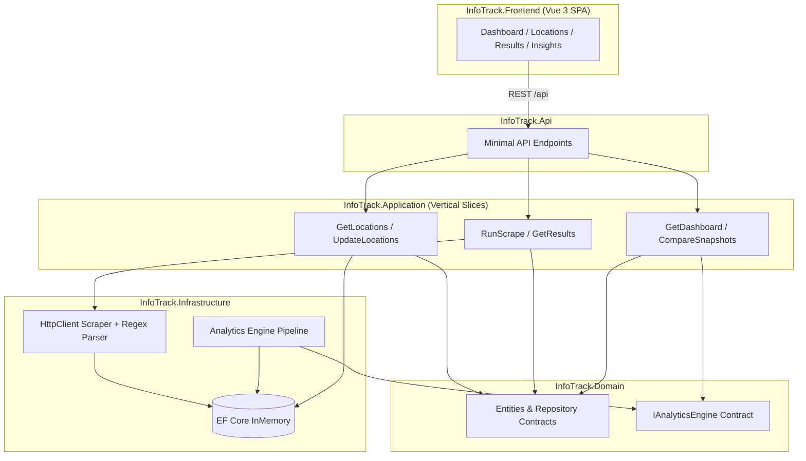

# InfoTrack Solicitor Intelligence Platform

Technical assessment solution demonstrating production-grade .NET architecture, a Vue 3 executive dashboard, and an intentionally overengineered analytics engine designed for future microservice extraction.

## Architecture



### Clean Architecture + Vertical Slices

| Layer                        | Responsibility                                                                    |
| ---------------------------- | --------------------------------------------------------------------------------- |
| **InfoTrack.Domain**         | Entities, repository interfaces, analytics contracts, scraping abstractions       |
| **InfoTrack.Application**    | Feature handlers (`Features/Locations`, `Features/Scraping`, `Features/Insights`) |
| **InfoTrack.Infrastructure** | EF Core, HTTP scraping, regex HTML parser, analytics pipeline                     |
| **InfoTrack.Contracts**      | Shared API DTOs (records)                                                         |
| **InfoTrack.Api**            | Composition root, Swagger, CORS, ProblemDetails                                   |
| **InfoTrack.Frontend**       | Vue 3 + TypeScript executive dashboard                                            |
| **InfoTrack.Tests**          | Parser, analytics, and integration tests                                          |

Dependencies flow inward: Api → Application → Domain. Infrastructure implements Domain abstractions.

## Project structure

```
InfoTrack/
├── InfoTrack.sln
├── InfoTrack.Api/              # ASP.NET Core Web API host
├── InfoTrack.Application/      # Vertical slice handlers
│   └── Features/
│       ├── Locations/
│       ├── Scraping/
│       └── Insights/
├── InfoTrack.Domain/             # Core domain model
├── InfoTrack.Infrastructure/   # EF Core, scraper, analytics engine
├── InfoTrack.Contracts/        # REST DTOs
├── InfoTrack.Frontend/         # Vue 3 SPA
└── InfoTrack.Tests/            # xUnit + FluentAssertions
```

## How to run

### Prerequisites

- [.NET 10 SDK](https://dotnet.microsoft.com/download)
- [Node.js 20+](https://nodejs.org/)

### Backend

```bash
cd InfoTrack
dotnet run --project InfoTrack.Api
```

API: http://localhost:5080  
Swagger: http://localhost:5080/swagger

### Frontend

```bash
cd InfoTrack/InfoTrack.Frontend
npm install
npm run dev
```

SPA: http://localhost:5173 (proxies `/api` to the backend)

### Tests

```bash
cd InfoTrack
dotnet test
```

## API endpoints

| Method | Route                   | Description                                              |
| ------ | ----------------------- | -------------------------------------------------------- |
| GET    | `/api/locations`        | List configured scrape locations                         |
| POST   | `/api/locations`        | Replace location list `{ "locations": ["London", ...] }` |
| POST   | `/api/scrape`           | Scrape all active locations and generate analytics       |
| GET    | `/api/results`          | Latest solicitor listings grouped by location            |
| GET    | `/api/insights`         | Executive dashboard summary                              |
| GET    | `/api/insights/compare` | Snapshot delta comparison                                |

## Technology choices

| Area        | Choice                                               | Rationale                                                                         |
| ----------- | ---------------------------------------------------- | --------------------------------------------------------------------------------- |
| Runtime     | **.NET 10**                                          | Latest LTS-track release; modern C# features, performance, first-class DI/logging |
| Persistence | **EF Core InMemory**                                 | Zero-configuration assessment setup; swappable for SQL Server in production       |
| API         | **Minimal APIs + Swagger + ProblemDetails**          | Lean, readable endpoints with OpenAPI and RFC 7807 errors                         |
| Frontend    | **Vue 3 + Vite + Pinia + Chart.js**                  | Matches job spec; fast DX; professional dashboard charts                          |
| Scraping    | **HttpClient + Regex + string ops**                  | Assessment constraint; demonstrates deliberate parsing logic                      |
| Testing     | **xUnit + FluentAssertions + WebApplicationFactory** | Industry-standard .NET testing stack                                              |

### Why .NET 10?

.NET 10 is the current platform for greenfield services at scale: improved JIT performance, unified SDK tooling, mature minimal hosting model, and alignment with InfoTrack's existing C# / ASP.NET Core stack. Using the latest stable release signals modern engineering practice without experimental risk.

## How the scraper works

InfoTrack mirrors the successful [solicitors.com](https://www.solicitors.com/) conveyancing search path without driving the browser form:

1. **Site search flow (reference)**: The homepage form posts to `/prepare-search.asp` with area-of-law (`did=192` for Conveyancing) and a location string. Partial location keystrokes call `/scripts/locations.asp?ajax=1&q=…` for autocomplete; an empty or unmatched location falls back to the generic [`/conveyancing.html`](https://www.solicitors.com/conveyancing.html) hub (informational content, no ranked listings). A resolved location such as London loads [`/conveyancing+london.html`](https://www.solicitors.com/conveyancing+london.html) with `.result-item` / `.result-item.item-small` solicitor cards.

2. **Direct fetch**: Configured locations are normalised to lowercase slugs (`London` → `london`) and fetched from `/conveyancing+{location}.html` via typed `HttpClient` (`ISolicitorsScrapeClient`), with configurable delay and User-Agent.

3. **Parse**: `SolicitorsHtmlParser` extracts each `<div class="result-item">` block (including `item-small` variants) and reads:
   - Firm name from `<span class="h2">` (stopping before quality-mark or review markup)
   - Phone from `tel:` anchors (full cards and compact `item-small` rows)
   - Address from `<address>`
   - Website / email enquiry links by locating `fa-globe` / `fa-envelope` icons within their parent `<a>` tags
   - Star ratings from `star-full` / `star-half` / `star-none` CSS classes
   - Review counts from `(123)` patterns

4. **Persist**: Solicitors are upserted by stable `ExternalKey` (SHA-256 of name + address + phone). Each scrape creates an immutable `ScrapeSnapshot` with ranked entries.

5. **Analytics**: The analytics engine compares the new snapshot to the previous one and persists an `InsightSummary`.

No HtmlAgilityPack or AngleSharp is used — parsing is intentionally manual.

## Intentionally overengineered: Analytics Engine

The **Analytics Engine** is the deliberate "show-off" component, structured as an extractable microservice:

```
IAnalyticsEngine
├── SnapshotComparer        → new/removed solicitor detection, regional deltas
├── RankingEngine           → national leaderboard, rank change tracking
├── RegionalStatisticsCalculator → firm counts, average ratings, review totals
├── GrowthDetector          → new entrants, review growth, rating improvements
└── DashboardSummaryBuilder → executive dashboard aggregation
```

Capabilities:

- Historical snapshots with immutable point-in-time records
- Snapshot comparison and delta detection
- New / removed solicitor identification per region
- National leaderboard with rank movement
- Regional statistics and growth signals
- Dashboard summary persisted as JSON for evolution towards event-driven analytics

The `IAnalyticsEngine` interface lives in **Domain** so this pipeline could be extracted to `InfoTrack.AnalyticsService` behind a message bus (e.g. `ScrapeCompleted` events) without changing application handlers.

## Starting fresh

Early in design, pre-populating the database with default locations felt like the obvious convenience — a ready-made demo that would let assessors skip straight to scraping. That option was idealised on conception: eight cities, one click, instant dashboard.

I later set it aside, deliberately.

On first launch, InfoTrack begins **empty**. No locations. No discovery history. No scrape snapshots. No leaderboard. The dashboard waits quietly for work to do. That is not a missing feature; it is the first impression I intend.

I want the application to be **witnessed in its native, fresh, and raw state** — then brought to life by the person using it. Discovery pulls the canonical catalogue from the solicitors.com sitemap. Locations is where you choose what to watch. Run Scrape fills the market with data. Results and Insights only earn their meaning once you have put something there yourself.

That arc — from blank slate to populated intelligence — is the user experience. I built the guided onboarding tour to honour it: welcome at the brand, walk the sidebar, discover, configure, scrape, explore. Start to finish. Fruition.

Seeding would have shortened that journey into a foregone conclusion. I preferred the longer path, where empty stat cards and quiet panels are not errors but invitations.

See the comment in `InfoTrack.Api/Program.cs` where the schema is created without seed data.

## Known limitations

- **InMemory database** — data is lost on restart; not suitable for production persistence.
- **Live scraping** — depends on solicitors.com HTML structure; site changes may require parser updates.
- **Rate limiting** — polite delay between requests; no retry/circuit-breaker policies (would add Polly in production).
- **Email addresses** — the source site exposes enquiry form links, not direct email addresses.
- **Bradford / smaller cities** — some locations may return fewer listings depending on site coverage.
- **Shared InMemory DB in tests** — integration tests use a single named in-memory store.

## Future improvements

- Replace InMemory with **SQL Server** + migrations
- Add **Polly** resilience policies on `HttpClient`
- Publish **`ScrapeCompleted`** integration events to Azure Service Bus
- Extract analytics to a dedicated **microservice** with read-optimised projections
- Add **OpenTelemetry** distributed tracing across API and analytics pipeline
- Containerise with **Docker** and deploy via **Azure DevOps** pipelines
- Cache scrape results with TTL for high-availability read paths
- Add authentication/authorisation for multi-tenant location configuration

## Engineering philosophy

This solution optimises for **clarity over cleverness**: small feature handlers, explicit dependencies, immutable DTOs, structured logging, and an analytics subsystem that looks like the first service in a larger cloud-native platform — not a throwaway assessment script.

It also optimises for **experienced emptiness**: I want the product to feel inhabited because someone used it, not because I seeded it.
