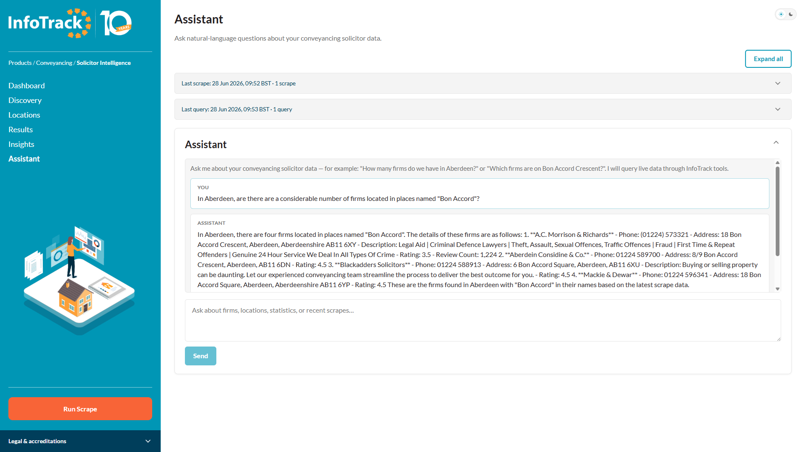
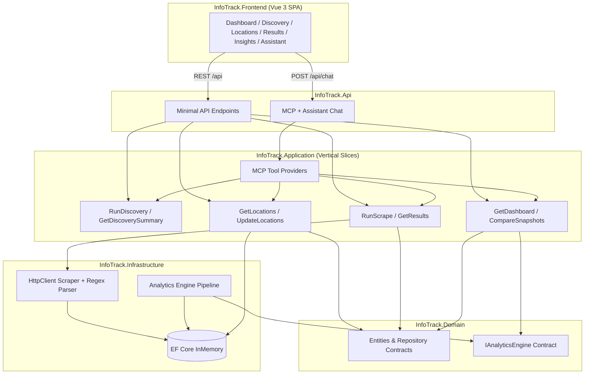

# InfoTrack Solicitor Intelligence Platform

My technical assessment solution demonstrates production-grade .NET architecture, a Vue 3 executive dashboard, and an intentionally overengineered analytics engine designed for future microservice extraction.

| **Assistant (built-in chat UI)** |
| :---: |
|  |

The **Assistant** page is InfoTrack’s built-in chat UI for MCP-backed queries — you do not need a separate MCP client. **It still requires a local inference server** (LM Studio, [Qube](https://github.com/dagaza/Qube), Ollama, or any OpenAI-compatible host on `localhost`): InfoTrack orchestrates tool calls and forwards prompts to that server; it does not run a model itself. The screenshot above shows the page in action once scrape data and a running LLM backend are in place.

## Architecture



### Clean Architecture + Vertical Slices

| Layer                        | Responsibility                                                                    |
| ---------------------------- | --------------------------------------------------------------------------------- |
| **InfoTrack.Domain**         | Entities, repository interfaces, analytics contracts, scraping abstractions       |
| **InfoTrack.Application**    | Feature handlers (`Features/Locations`, `Features/Scraping`, `Features/Insights`) |
| **InfoTrack.Infrastructure** | EF Core, HTTP scraping, regex HTML parser, analytics pipeline                     |
| **InfoTrack.Contracts**      | Shared API DTOs (records)                                                         |
| **InfoTrack.Api**            | Composition root, Swagger, CORS, ProblemDetails                                   |
| **InfoTrack.Frontend**       | Vue 3 + TypeScript executive dashboard                                            |
| **InfoTrack.Tests**          | Parser, analytics, and integration tests                                          |

Dependencies flow inward: Api → Application → Domain. Infrastructure implements Domain abstractions.

## Project structure

```
InfoTrack/
├── InfoTrack.sln
├── InfoTrack.Api/              # ASP.NET Core Web API host
│   ├── Assistant/              # SPA chat endpoint + local LLM client
│   └── Mcp/                    # JSON-RPC MCP server + tool listing
├── InfoTrack.Application/      # Vertical slice handlers
│   └── Features/
│       ├── Discovery/
│       ├── Locations/
│       ├── Scraping/
│       ├── Insights/
│       └── Mcp/                # Tool providers for MCP + assistant
├── InfoTrack.Domain/           # Core domain model
├── InfoTrack.Infrastructure/   # EF Core, scraper, sitemap discovery, analytics engine
├── InfoTrack.Contracts/        # REST DTOs
├── InfoTrack.Frontend/         # Vue 3 SPA (onboarding tour, header history UI)
└── InfoTrack.Tests/            # xUnit + FluentAssertions
```

## How to run

### Prerequisites

- [.NET 10 SDK](https://dotnet.microsoft.com/download)
- [Node.js 20+](https://nodejs.org/)

### Backend

```bash
cd InfoTrack
dotnet run --project InfoTrack.Api
```

API: http://localhost:5080  
Swagger: http://localhost:5080/swagger

### Frontend

```bash
cd InfoTrack/InfoTrack.Frontend
npm install
npm run dev
```

SPA: http://localhost:5173 (proxies `/api` to the backend)

### Tests

```bash
cd InfoTrack
dotnet test
```

## API endpoints

| Method | Route                        | Description                                              |
| ------ | ---------------------------- | -------------------------------------------------------- |
| GET    | `/api/locations`             | List configured scrape locations                         |
| POST   | `/api/locations`             | Replace location list `{ "locations": ["London", ...] }` |
| POST   | `/api/discovery/run`         | Discover locations from sitemap and sync catalogue       |
| GET    | `/api/discovery/summary`     | Discovery summary and historical trend                   |
| GET    | `/api/discovery/runs/latest` | Most recent completed discovery run                      |
| GET    | `/api/discovery/runs`        | Discovery run history                                    |
| POST   | `/api/scrape`                | Scrape all active locations and generate analytics       |
| GET    | `/api/results`               | Latest solicitor listings grouped by location            |
| GET    | `/api/insights`              | Executive dashboard summary                              |
| GET    | `/api/insights/compare`      | Snapshot delta comparison                                |
| POST   | `/api/chat`                  | Natural-language assistant (local LLM + MCP tools)       |
| GET    | `/api/mcp/tools`             | List MCP tool definitions (API key required)             |
| POST   | `/api/mcp/assistant`         | MCP-aware assistant endpoint (API key required)            |
| POST   | `/api/mcp`                   | MCP JSON-RPC endpoint (API key required)                 |

## Technology choices

| Area        | Choice                                               | Rationale                                                                         |
| ----------- | ---------------------------------------------------- | --------------------------------------------------------------------------------- |
| Runtime     | **.NET 10**                                          | Latest LTS-track release; modern C# features, performance, first-class DI/logging |
| Persistence | **EF Core InMemory**                                 | Zero-configuration assessment setup; swappable for SQL Server in production       |
| API         | **Minimal APIs + Swagger + ProblemDetails**          | Lean, readable endpoints with OpenAPI and RFC 7807 errors                         |
| Frontend    | **Vue 3 + Vite + Pinia + Chart.js**                  | Matches job spec; fast DX; professional dashboard charts                          |
| Assistant   | **Local OpenAI-compatible LLM + MCP tool calling**   | Structured natural-language access to live InfoTrack data                         |
| Scraping    | **HttpClient + Regex + string ops**                  | Assessment constraint; demonstrates my deliberate parsing logic                      |
| Testing     | **xUnit + FluentAssertions + WebApplicationFactory** | Industry-standard .NET testing stack                                              |

### Why .NET 10?

.NET 10 is the current platform for greenfield services at scale: improved JIT performance, unified SDK tooling, mature minimal hosting model, and alignment with InfoTrack's existing C# / ASP.NET Core stack. Using the latest stable release signals modern engineering practice without experimental risk.

## How the scraper works

InfoTrack mirrors the successful [solicitors.com](https://www.solicitors.com/) conveyancing search path without driving the browser form:

1. **Site search flow (reference)**: The homepage form posts to `/prepare-search.asp` with area-of-law (`did=192` for Conveyancing) and a location string. Partial location keystrokes call `/scripts/locations.asp?ajax=1&q=…` for autocomplete; an empty or unmatched location falls back to the generic [`/conveyancing.html`](https://www.solicitors.com/conveyancing.html) hub (informational content, no ranked listings). A resolved location such as London loads [`/conveyancing+london.html`](https://www.solicitors.com/conveyancing+london.html) with `.result-item` / `.result-item.item-small` solicitor cards.

2. **Direct fetch**: Configured locations are normalised to lowercase slugs (`London` → `london`) and fetched from `/conveyancing+{location}.html` via typed `HttpClient` (`ISolicitorsScrapeClient`), with configurable delay and a transparent User-Agent (see [Outbound HTTP: pre-implementation considerations](#outbound-http-pre-implementation-considerations)).

3. **Parse**: `SolicitorsHtmlParser` extracts each `<div class="result-item">` block (including `item-small` variants) and reads:
   - Firm name from `<span class="h2">` (stopping before quality-mark or review markup)
   - Phone from `tel:` anchors (full cards and compact `item-small` rows)
   - Address from `<address>`
   - Website / email enquiry links by locating `fa-globe` / `fa-envelope` icons within their parent `<a>` tags
   - Star ratings from `star-full` / `star-half` / `star-none` CSS classes
   - Review counts from `(123)` patterns

4. **Persist**: Solicitors are upserted by stable `ExternalKey` (SHA-256 of name + address + phone). Each scrape creates an immutable `ScrapeSnapshot` with ranked entries.

5. **Analytics**: The analytics engine compares the new snapshot to the previous one and persists an `InsightSummary`.

I use neither HtmlAgilityPack nor AngleSharp — parsing is intentionally manual.

## Outbound HTTP: pre-implementation considerations

Before building the outbound resilience layer, I evaluated **randomised User-Agent rotation** on calls to [solicitors.com](https://www.solicitors.com/) — varying each request with a pool of browser-like strings (Chrome, Safari, Firefox) instead of a fixed client identifier.

My goal was to understand whether that would materially reduce blocking or throttling. My conclusion: **it is a light fingerprint-variation technique, not a protective measure in the security sense.** It might help against naïve rules (identical headers at high frequency, obvious JMeter / .NET / Python client strings), but it does not address the constraints that actually dominate on a site I scrape programmatically:

| User-Agent rotation might help with | It does not meaningfully address |
| ----------------------------------- | -------------------------------- |
| Naïve header-based bot rules | IP- or session-based rate limiting (HTTP 429) |
| Slightly less uniform traffic in upstream logs | Behavioural detection (burst patterns, no navigation flow) |
| Blocking of obvious non-browser client strings | IP reputation, cookie/session tracking, browser fingerprinting |

For InfoTrack specifically — direct fetches to `/conveyancing+{location}.html`, sitemap discovery, and repeated AJAX-style catalogue endpoints — **request rate, crawl pacing, burst shape, and IP reputation matter far more than the User-Agent string.**

### What I implemented instead

Rather than impersonating browsers, I chose **transparency plus robust outbound behaviour**:

1. **Identifiable User-Agent** — a fixed, honest client string (`InfoTrack-Assessment/1.0`) on discovery and scrape `HttpClient` instances, configurable via `Discovery:UserAgent` and `Scraping:UserAgent` in `appsettings.json`. Upstream operators can identify my traffic; I am not disguising the client.
2. **Outbound resilience (Polly v8)** — concurrency limits, per-pipeline pacing, exponential retry with jitter, `Retry-After` handling on 429/503, circuit breaker, and structured telemetry. See [HTTP resilience (Polly v8)](#http-resilience-polly-v8) below.
3. **Inbound API rate limiting** — the `/api/*` endpoints I expose return HTTP 429 under abuse, mirroring the upstream constraint I expect when scraping aggressively. See [Inbound API rate limiting](#inbound-api-rate-limiting).

User-Agent rotation remains a reasonable **hygiene option for JMeter realism** (mixed client fingerprints in load tests), but I deliberately **did not** adopt it as a production scraping strategy. I put the engineering effort into polite pacing and fault tolerance — the changes that actually improve robustness when solicitors.com (or any upstream) pushes back.

## HTTP resilience (Polly v8)

All outbound HTTP traffic (sitemap discovery, solicitor scraping, and future integrations) flows through named **Polly v8** pipelines registered via `IHttpClientFactory`.

### Pipeline strategies (outer → inner)

| Strategy | Purpose |
| -------- | ------- |
| **Concurrency limiter** | Caps simultaneous outbound requests (`MaxConcurrentRequests`) |
| **Outbound pacing** | Enforces minimum interval between requests (`RequestsPerSecond`) |
| **Total request timeout** | End-to-end ceiling including retries |
| **Retry** | Transient faults only; honours `Retry-After` on 429/503 |
| **Circuit breaker** | Opens after sustained failure ratio; half-open recovery |
| **Attempt timeout** | Per-try timeout (connect handled by `SocketsHttpHandler.ConnectTimeout`) |

Configuration lives under `Resilience:Defaults` with optional `Resilience:Clients:{Scraping|Discovery}` overrides. Legacy `Scraping:Resilience` / `Discovery:Resilience` sections are merged for backwards compatibility.

Discovery and scrape UIs surface resilience progress (`WaitingForRateLimit`, `RetryingRequest`, `ContinuingAfterRetry`) via `IResilienceProgressNotifier`.

Structured logs and `System.Diagnostics.Metrics` counters (`http.client.retries.total`, `http.client.circuit_breaker.transitions`, etc.) are emitted from `HttpResilienceTelemetry` for OpenTelemetry/Prometheus export.

Implementation: `InfoTrack.Infrastructure/Resilience/`.

## Inbound API rate limiting

All `/api/*` routes are protected by ASP.NET Core **fixed-window, per-client-IP** rate limiters (honours `X-Forwarded-For` when present). Throttled callers receive **HTTP 429** with a **`Retry-After`** header and JSON problem body.

| Policy | Routes | Default limit |
| ------ | ------ | ------------- |
| **api-reads** | GET endpoints (insights, results, discovery status, …) | 600 requests / 60s / IP |
| **api-writes** | POST endpoints (scrape, discovery, locations, MCP, chat) | 30 requests / 60s / IP |

Configuration: `RateLimiting` in `InfoTrack.Api/appsettings.json`. Set `RateLimiting:Enabled` to `false` to disable. Swagger is not rate-limited.

JMeter abuse verification: [`JMeter/tests/jmeter/ApiAbuseTest.jmx`](JMeter/tests/jmeter/ApiAbuseTest.jmx) + `run-abuse-test.ps1` (run the API with a low `RateLimiting__ReadPermitLimit` first).

## Load & smoke testing (JMeter)

Lightweight JMeter plans live in [`JMeter/tests/jmeter/`](JMeter/tests/jmeter/). They cover API smoke checks, scrape concurrency, dashboard/insights read load, discovery, MCP authentication, and inbound **429** throttling. See that folder's README for prerequisites and run instructions.

## Intentionally overengineered: Analytics Engine

The **Analytics Engine** is my deliberate "show-off" component, structured as an extractable microservice:

```
IAnalyticsEngine
├── SnapshotComparer        → new/removed solicitor detection, regional deltas
├── RankingEngine           → national leaderboard, rank change tracking
├── RegionalStatisticsCalculator → firm counts, average ratings, review totals
├── GrowthDetector          → new entrants, review growth, rating improvements
└── DashboardSummaryBuilder → executive dashboard aggregation
```

Capabilities:

- Historical snapshots with immutable point-in-time records
- Snapshot comparison and delta detection
- New / removed solicitor identification per region
- National leaderboard with rank movement
- Regional statistics and growth signals
- Dashboard summary persisted as JSON for evolution towards event-driven analytics

The `IAnalyticsEngine` interface lives in **Domain** so this pipeline could be extracted to `InfoTrack.AnalyticsService` behind a message bus (e.g. `ScrapeCompleted` events) without changing application handlers.

## Additional features

Beyond the core scrape → results → insights workflow, I added four extra capabilities that support discovery, natural-language access, first-run guidance, and operational context in the page header.

### Discovery (sitemap location sync)

The **Discovery** page pulls the canonical conveyancing location catalogue from [solicitors.com](https://www.solicitors.com/) without manual data entry.

1. **Fetch sitemap index** — `SitemapDiscoveryProvider` downloads `/sitemap.xml` and resolves the conveyancing sitemap (`/google-sitemap4.xml` by default).
2. **Extract location slugs** — URLs matching `conveyancing+{slug}.html` are parsed into display names (e.g. `leamington-spa` → `Leamington Spa`).
3. **Synchronise catalogue** — `DiscoveryOrchestrator` upserts locations in the database, tracking added, updated, and removed entries per run.
4. **Review history** — Each run is persisted with statistics and exposed via `/api/discovery/runs` and the Discovery UI (summary cards, trend chart, run history table).

Discovery runs are independent of scraping. After discovery, use **Locations** to choose which cities to activate before **Run Scrape**.

Configuration lives under `Discovery` in `appsettings.json` (`BaseUrl`, `SitemapIndexPath`, `ConveyancingSitemapPath`, etc.).

### MCP Assistant

InfoTrack exposes a **Model Context Protocol (MCP)** tool surface and a conversational **Assistant** page that queries live scrape and analytics data in plain English.

Two separate pieces are involved:

1. **Local inference server (required)** — an OpenAI-compatible chat-completions API (LM Studio, Qube, Ollama, etc.) configured via `LocalLlm` in `appsettings.json`. Without this, `/api/chat` returns **503** and the Assistant page cannot respond.
2. **Chat surface (pick one)** — use the **Assistant** page in the SPA (see screenshot at the top of this README), *or* call the HTTP MCP endpoints (`/api/mcp`, `/api/mcp/assistant`) from an external MCP-aware client. Both paths invoke the same tool providers.

InfoTrack never hosts the LLM weights or inference runtime — only tool orchestration and the Vue chat shell.

**Architecture:**

- Tool providers in `InfoTrack.Application/Mcp/ToolProviders/` are discovered via `[McpTool]` attributes and registered in `McpToolRegistry`.
- The API hosts MCP JSON-RPC at `/api/mcp`, tool listing at `/api/mcp/tools`, and an MCP-aware assistant at `/api/mcp/assistant` (API key via `Authorization: Bearer {Mcp:ApiKey}`).
- The SPA uses `/api/chat`, which delegates to `McpAssistantService` and a **local OpenAI-compatible chat-completions endpoint** configured under `LocalLlm` in `appsettings.json`.

**Available MCP tools:**

| Tool | Purpose |
| ---- | ------- |
| `discover_locations` | Run sitemap discovery and sync the location catalogue |
| `scrape_location` | Configure one location and scrape it |
| `scrape_multiple_locations` | Configure and scrape multiple locations |
| `search_firms` | Search scraped firms by location and/or firm name |
| `get_statistics` | Headline dashboard stats, optionally filtered by location |
| `get_report` | Latest dashboard analytics report |
| `compare_reports` | Compare two scrape snapshots |
| `export_csv` / `export_excel` / `export_json` | Export latest solicitor results |

The assistant selects tools automatically (up to `LocalLlm:MaxToolRounds` rounds). Replies are sanitised for HTML entities and scraped text artefacts. Set `Mcp:EnableAssistant` and `LocalLlm:Enabled` to `true`, ensure your local model server is running, then open **Assistant** in the sidebar.

#### How to use the Assistant page

1. **Start a local LLM server** and confirm `LocalLlm:BaseUrl`, `LocalLlm:Model`, `Mcp:EnableAssistant`, and `LocalLlm:Enabled` in `appsettings.json` match your running host (see [Local LLM setup](#local-llm-setup)).
2. **Run a scrape** (sidebar **Run Scrape** or Discovery → Locations → scrape) so live firm data exists.
3. Open **Assistant** and ask a natural-language question — for example, *"Which firms are on Bon Accord Crescent?"* or *"How many firms are in Aberdeen?"* Location counts, firm lookups by address, dashboard stats, snapshot comparison, and exports are all reachable via tools.
4. Review **Query history** in the page header to revisit recent questions in the current browser session.

#### Local LLM setup

InfoTrack **does not** ship or run inference. You must start a separate process that exposes **`/v1/chat/completions`** in OpenAI-compatible form, then point `LocalLlm:BaseUrl` and `LocalLlm:Model` at it.

**LM Studio (common default)** — load a GGUF model and start the local server (default `http://localhost:1234`).

**[Qube](https://github.com/dagaza/Qube)** — a fully local, privacy-first desktop assistant with a built-in **llama.cpp** engine and **Model Manager** for downloading GGUF weights from Hugging Face. Many assessors already run Qube alongside other local-AI tooling; InfoTrack still needs its **own** OpenAI-compatible endpoint (typically LM Studio or Ollama on `localhost`, whether you start that server directly or through Qube’s external-server workflow). Windows installs:

- [WinGet](https://winstall.app/apps/dagaza.Qube) — `winget install dagaza.Qube`
- [Chocolatey](https://community.chocolatey.org/packages/qube) — `choco install qube`
- [GitHub releases](https://github.com/dagaza/Qube/releases)

Other options such as **Ollama** or **`llama.cpp serve`** work equally well as long as the base URL and model id match your running server.

**Suggested lightweight model:** the default `LocalLlm:Model` value of `qwen2.5-3b-instruct` is a practical starting point for basic assistant interaction — not a requirement for heavier workloads. A quantised build such as **`Q4_K_M`** from [lmstudio-community/Qwen2.5-3B-Instruct-GGUF on Hugging Face](https://huggingface.co/lmstudio-community/Qwen2.5-3B-Instruct-GGUF) is under **2 GB** (about 1.93 GB), which keeps local inference approachable on modest hardware. Larger models may answer more reliably but need more RAM and disk.

### Onboarding tour

A guided **getting-started tour** runs once on first visit (completion stored in `localStorage` under `infotrack-onboarding-completed`).

The tour is defined in `InfoTrack.Frontend/src/stores/onboarding.ts` and rendered by `OnboardingTour.vue`. Steps use `data-onboarding` targets across the shell:

1. Welcome and sidebar navigation
2. Dashboard metrics overview (with an interstitial on first dashboard visit)
3. Discovery → configure locations → run scrape
4. Results and Insights
5. Assistant composer

Steps can navigate between routes, spotlight multiple elements, and advance on target clicks (e.g. sidebar links). The tour mirrors the intentional **empty-first** experience documented in [Starting fresh](#starting-fresh).

### Header history UI

The page header includes a collapsible **header history** strip (`HeaderHistory.vue`) showing recent operational context without leaving the current view.

- **Scrape history** — Visible on all pages when scrape data exists. Shows last scrape time, run count, and per-run details (locations, timestamp, firm count). Data comes from `DashboardResponse.scrapeHistory`.
- **Query history** — Visible on the **Assistant** page only. Lists recent natural-language questions with timestamps from the Pinia `assistant` store (persists for the browser session).

Each history block is a `HistoryPanel` with the same expand/collapse interaction model as content panels: click the full header bar to toggle, use **Expand all** / **Collapse all** when multiple panels are present, and stretch to the full content-header width. Typed panel models and formatters live in `utils/historyPanelTypes.ts`; group expand/collapse state is coordinated via `utils/historyPanelRegistry.ts`.

## Starting fresh

Early in design, pre-populating the database with default locations felt like the obvious convenience — a ready-made demo that would let assessors skip straight to scraping. That option was idealised on conception: eight cities, one click, instant dashboard.

I later set it aside, deliberately.

On first launch, InfoTrack begins **empty**. No locations. No discovery history. No scrape snapshots. No leaderboard. The dashboard waits quietly for work to do. That is not a missing feature; it is the first impression I intend.

I want the application to be **witnessed in its native, fresh, and raw state** — then brought to life by the person using it. Discovery pulls the canonical catalogue from the solicitors.com sitemap. Locations is where you choose what to watch. Run Scrape fills the market with data. Results and Insights only earn their meaning once you have put something there yourself.

That arc — from blank slate to populated intelligence — is the user experience. I built the guided onboarding tour to honour it: welcome at the brand, walk the sidebar, discover, configure, scrape, explore. Start to finish. Fruition.

Seeding would have shortened that journey into a foregone conclusion. I preferred the longer path, where empty stat cards and quiet panels are not errors but invitations.

See the comment in `InfoTrack.Api/Program.cs` where the schema is created without seed data.

## Known limitations

- **Local LLM dependency** — the Assistant **will not work** without a running OpenAI-compatible inference server (`LocalLlm:BaseUrl`); InfoTrack does not embed a model and returns **503** when the server is unreachable. [Qube](https://github.com/dagaza/Qube), LM Studio, Ollama, and other compatible hosts are supported. The Assistant page is only the chat UI — it is not a substitute for that server.
- **InMemory database** — data is lost on restart; not suitable for production persistence.
- **Live scraping** — depends on solicitors.com HTML structure; site changes may require parser updates.
- **Outbound resilience** — Polly v8 pipelines with retry, circuit breaker, concurrency/rate pacing, and structured telemetry; no scheduled scrape/discovery jobs yet.
- **Email addresses** — the source site exposes enquiry form links, not direct email addresses.
- **Bradford / smaller cities** — some locations may return fewer listings depending on site coverage.
- **Shared InMemory DB in tests** — integration tests use a single named in-memory store.

## Design decisions and implementation notes

While building InfoTrack, I captured a set of design questions — some resolved in code, others deferred deliberately. This section records how I thought about each one and what I chose in practice.

### Architecture and structure

| Topic | Consideration | Decision |
| ----- | ------------- | -------- |
| **Clean architecture** | Layering vs. a monolith script | **Yes** — `Domain` → `Application` → `Infrastructure` / `Api`, with dependencies flowing inward and repository/analytics abstractions on the domain boundary. Supports extraction of the analytics engine later without rewriting handlers. |
| **Handlers (CQRS)** | Full MediatR pipeline vs. plain classes | **CQRS-lite** — one handler class per vertical slice (`GetDashboardHandler`, `StartScrapeHandler`, …) injected directly into minimal API routes. No MediatR bus: the indirection did not earn its keep at assessment scale. |
| **Minimal APIs vs. controllers** | Lean endpoints vs. familiar MVC structure | **Minimal APIs** — routes live in `Program.cs` and extension methods. Good: fewer files, obvious HTTP mapping, fits .NET 10 hosting model. Trade-off: `Program.cs` grows; I accept that for readability of the full surface area in one place. |
| **File-scoped namespaces** | `namespace X;` vs. block namespaces | **Good — adopted throughout** — less nesting, aligns with modern C# style in .NET 6+. |
| **Microsoft-idiomatic coding** | Framework conventions vs. custom patterns | **Mostly yes** — primary constructors, `sealed` types, `IHttpClientFactory`, `IOptions`, `ProblemDetails`, `WebApplicationFactory` tests, and Polly v8 HTTP resilience. I avoided heavier stacks (MediatR, AutoMapper, controller base classes) where a simpler pattern was clearer. |

### Data, persistence, and mapping

| Topic | Consideration | Decision |
| ----- | ------------- | -------- |
| **In-Memory (lossy vs. database)** | Zero-config demo vs. durable storage | **EF Core InMemory deliberately** — no migrations or connection strings for assessors; data is **lossy on restart**, which pairs with my [Starting fresh](#starting-fresh) intent. SQL Server is the documented production path (see [Future improvements](#future-improvements)). |
| **AutoMapper** | Library vs. explicit `Map` methods | **Manual mapping** — private/static mappers on handlers, e.g. `MapSolicitor` in `GetResultsHandler`. Records in `InfoTrack.Contracts` make shapes obvious; AutoMapper would hide field correspondence and add a dependency for little gain here. |

### Long-running operations and HTTP semantics

| Topic | Consideration | Decision |
| ----- | ------------- | -------- |
| **Asynchronous operations (repeated calls)** | Block until scrape/discovery completes vs. poll | **202 Accepted + operation id + status polling** — `POST /api/scrape` and `POST /api/discovery/run` enqueue work on a background channel; clients poll `/runs/{operationId}/status`. The Vue SPA uses `useOperationPolling`; MCP sync tool paths (`RunScrapeHandler`, `RunDiscoveryHandler`) poll internally for tool ergonomics. Mutex semantics return **409** when a run is already in flight. |
| **Minimal / default status codes** | Rely on framework defaults vs. be explicit | **Explicit** — I return `Results.Ok`, `Results.Accepted` (with `Location`), `Results.NotFound`, `Results.Conflict`, and `Results.ValidationProblem` per route rather than assuming 200/500 defaults. Makes JMeter assertions and OpenAPI descriptions truthful. |
| **Exception handling** | Global filter vs. inline vs. extensive try/catch | **Hybrid, intentionally narrow** — `UseExceptionHandler` + `AddProblemDetails` for unhandled faults; **expected** failures caught at the route (`ArgumentException` → validation problem, `InvalidOperationException` → conflict). MCP tool execution wraps failures in `McpToolExecutionResult.Error` inside `McpToolRegistry`. I did not add a custom exception hierarchy — the assessment surface is small enough to keep handlers honest. |
| **HTTP 429** | Ignore, outbound-only, or inbound too? | **Good — both directions** — outbound Polly pipelines honour upstream `Retry-After` on 429/503; inbound ASP.NET Core rate limiting returns 429 + `Retry-After` on abusive `/api/*` traffic (see [Inbound API rate limiting](#inbound-api-rate-limiting)). Teaches the same constraint from client and server perspectives. |

### Scraping strategy

| Topic | Consideration | Decision |
| ----- | ------------- | -------- |
| **Direct ASP/HTML fetch vs. form simulation** | Drive `/prepare-search.asp` + `/scripts/locations.asp?ajax=1` vs. fetch listing pages directly | **Direct HTTP GET** to `/conveyancing+{location}.html` (and sitemap URLs for discovery) — fewer round trips, no session/cookie simulation, parser targets stable `.result-item` markup. I document the browser form flow as reference only; emulating keystroke autocomplete would add complexity without improving data quality for configured slugs. |

### Security, auth, and input

| Topic | Consideration | Decision |
| ----- | ------------- | -------- |
| **JWT** | Token auth for SPA and API | **Not yet** — REST `/api/*` and `/api/chat` are open on localhost for assessment simplicity. MCP JSON-RPC and `/api/mcp/tools` use **`Authorization: Bearer {ApiKey}`** with constant-time comparison (`McpApiKeyValidator`). JWT (or OAuth2) belongs with multi-tenant auth in [Future improvements](#future-improvements). |
| **Credential leaking from MCP** | API keys in config, logs, tool output | **Acceptable for local dev; risky if copied to production unchanged** — default `dev-mcp-api-key-change-me` in `appsettings.json` is intentional for clone-and-run. I validate keys with `CryptographicOperations.FixedTimeEquals` and do not return the key from tool results. Production would move secrets to user secrets / Key Vault and restrict MCP to HTTPS (`Mcp:RequireHttps`). `/api/chat` has no API-key gate today — fine behind localhost, not fine on a public host. |
| **ASP/JS injection from free-text inputs (e.g. Locations)** | XSS or injection via location names | **Low risk with current design** — location names are trimmed, stored as plain strings, and rendered in Vue via text interpolation (no `v-html` on user input). Scraped HTML is decoded and stripped in `SolicitorsHtmlParser` / `ScrapedTextNormalizer` before persistence; assistant replies pass through `ScrapedTextNormalizer`. I do not echo raw location text into outbound scrape URLs (slugs come from the catalogue). Full defence-in-depth would add server-side length/character rules and Content-Security-Policy headers. |

### Configuration, docs, and feature toggles

| Topic | Consideration | Decision |
| ----- | ------------- | -------- |
| **Feature-flagging** | LaunchDarkly-style flags vs. config | **Configuration toggles only** — `Mcp:Enabled`, `Mcp:EnableAssistant`, `LocalLlm:Enabled`, `RateLimiting:Enabled` switch behaviour via `appsettings.json` / environment variables (including the `AbuseTest` launch profile). Enough for assessment and integration tests; not a full feature-flag platform. |
| **Swagger / OpenAPI policies** | Document shape, virtual routes, dev ports | **Swashbuckle** with OpenAPI **v1** document metadata; `McpToolDocumentFilter` adds virtual `/api/mcp/tools/{toolName}` paths so MCP tools appear in Swagger without being separate REST handlers. Dev SPA proxies `/api` to port **5080** via Vite — no host aliasing in the API itself. |
| **Scalar** | Scalar UI vs. Swagger UI for OpenAPI | **Deferred** — Swagger UI ships with the template and satisfies assessment needs. [Scalar](https://github.com/scalar/scalar) would be a nicer read-only docs experience; I would add it alongside or instead of Swagger UI when polishing developer UX, not before core behaviour is stable. |

## Future improvements

- Replace InMemory with **SQL Server** + migrations
- Publish **`ScrapeCompleted`** integration events to Azure Service Bus
- Extract analytics to a dedicated **microservice** with read-optimised projections
- Add **OpenTelemetry** distributed tracing across API and analytics pipeline
- Containerise with **Docker** and deploy via **Azure DevOps** pipelines
- Cache scrape results with TTL for high-availability read paths
- Add authentication/authorisation for multi-tenant location configuration
- Introduce **API versioning** — see [API versioning (planned)](#api-versioning-planned) below
- Evolve toward the full **product vision (PRD v1.0)** — see [Product vision (PRD v1.0)](#product-vision-prd-v10) below
- Add **AI executive intelligence briefings** — see [AI executive intelligence briefings (planned)](#ai-executive-intelligence-briefings-planned) below

### Product vision (PRD v1.0)

During implementation I drafted a **Product Requirements Document** for a *Conveyancing Market Intelligence Platform* — the product InfoTrack is intended to become, not merely what the assessment delivers today. The vision: continuously monitor UK conveyancing solicitor directories, retain historical intelligence, detect market change, and present executive-ready insights through a simple, highly visual dashboard.

**Problem the PRD addresses:** directory sites show current snapshots only. Executives today must manually collect data, compare spreadsheets, and spot trends themselves. The platform should answer questions such as *Who are the highest-performing firms?*, *Which firms are growing fastest?*, *Who entered or left the market?*, and *How is reputation shifting?* — without raw scrape tables.

**Primary users:** CEO (≤5-minute market grasp), Managing Director (competitor monitoring), Marketing Director (review trends and regional opportunity).

#### PRD goals vs. current InfoTrack

| PRD goal | Today in InfoTrack | Gap / next step |
| -------- | ------------------ | --------------- |
| Continuously updated firm database from public directories | Scrape + discovery from [solicitors.com](https://www.solicitors.com/); catalogue sync via sitemap | Scheduled scrapes; additional directory sources |
| Track changes over time | Immutable `ScrapeSnapshot` records; `SnapshotComparer`; `/api/insights/compare` | Daily/weekly cadence; longer retention in SQL Server |
| Executive-ready insights and rankings | `IAnalyticsEngine` pipeline — `RankingEngine`, `RegionalStatisticsCalculator`, `GrowthDetector`, dashboard KPIs | Weighted/fair ranking; richer filtering by county and period |
| Detect significant market events automatically | `GrowthSignal` detection (new entrants, review growth, rating improvement) | Dedicated **market events feed**; alert thresholds; rating *decline* signals |
| Intuitive executive dashboard | Vue dashboard, Insights, Results, stat cards and charts | 30-second CEO scan target; firm detail pages with trend charts |

#### PRD features — delivery map

| PRD feature | Status | Notes |
| ----------- | ------ | ----- |
| **Directory scraping** (solicitors.com) | **Delivered (v1)** | Direct HTML fetch + parser; see [How the scraper works](#how-the-scraper-works) |
| Multi-source scraping (reviewsolicitors, reallymoving, …) | **Planned** | `ISolicitorsScrapeClient`-style abstractions per source; PRD non-functional requirement: add sources without modifying existing implementations |
| **Historical snapshots** (never overwrite) | **Delivered (v1)** | Point-in-time snapshots per scrape run |
| Scheduled daily/weekly snapshots | **Planned** | Background jobs + Azure Service Bus (`ScrapeCompleted` events) |
| **Change detection** (new/removed firms, rating/review deltas) | **Partially delivered** | `SnapshotComparer`, `GrowthDetector`; ranking movement via `RankChange` |
| **Executive dashboard** | **Partially delivered** | `/api/insights` + Dashboard view; not yet all PRD KPIs (e.g. “highest rating increase this week”) |
| **National rankings** | **Partially delivered** | Leaderboard by rating then review count; **weighted ranking** (RK-002) not yet implemented |
| **Market events feed** (chronological timeline) | **Planned** | Extend `GrowthSignal` into persisted events with severity and feed UI |
| **Firm detail view** (history, trend charts) | **Planned** | Per-firm profile route; rating/review time series from snapshot history |
| **Market insights** (regional charts, KPI cards) | **Partially delivered** | Regional breakdown; expand fastest-growing regions and market growth trends |
| **Weekly executive briefing** | **Planned** | See [AI executive intelligence briefings](#ai-executive-intelligence-briefings-planned) |
| **Alerts** (AL-001) | **Planned** | Auto-generated alerts on dashboard; ties to events feed |
| MCP / natural-language access | **Delivered (beyond PRD)** | Assistant + tool providers — ad hoc queries, not scheduled briefings |

#### PRD user-story themes (backlog)

| Epic | Representative stories | PRD intent |
| ---- | ---------------------- | ---------- |
| **Market monitoring** (MM-001, MM-002) | Total firms; highlight new discoveries with date filters | Dashboard reflects latest scrape; new entrants visible |
| **Reputation monitoring** (RM-001, RM-002) | Declining ratings; rapid review growth | Events and sortable growth rankings |
| **Rankings** (RK-001, RK-002) | National leaderboard; statistically fair weighted scores | Filter by region/county/period; methodology explanation |
| **Historical analysis** (HA-001, HA-002) | Trend charts; week-over-week and month-over-month compare | Date-range selection beyond latest two snapshots |
| **Alerts** (AL-001) | Significant changes surfaced automatically | No manual dashboard review required |

#### PRD non-functional requirements and success metrics (targets)

| Area | PRD target | Current posture |
| ---- | ---------- | --------------- |
| **Performance** | Dashboard ≤3s; search ≤2s | Acceptable on localhost; SQL + caching needed at scale |
| **Reliability** | Failed scrapes must not corrupt history | Snapshots immutable; failed runs logged; orchestrator marks run failed |
| **Scalability** | New directory sources without changing existing code | Clean architecture + client abstractions support this; not yet multi-source |
| **Auditability** | Source, date collected, timestamp on every record | Snapshots timestamped; source URL implicit (single site today) |
| **Success** | 1,000+ firms; auto change detection; weekly summaries; 80% less manual research | Architecture supports scale; firm count depends on active locations; briefing not yet built |

#### PRD future enhancements (beyond v1 scope)

These sit alongside other [Future improvements](#future-improvements): AI market commentary, predictive growth scoring, acquisition-target detection, automated email reports, regional heatmaps, competitor comparison reports, CRM integration, and export to Excel/PDF (MCP export tools cover JSON/CSV/Excel for latest results today).

---

### AI executive intelligence briefings (planned)

**Priority:** High · **Epic:** Executive Market Intelligence Platform · **Status:** Backlog

I captured a separate feature ticket for **AI Executive Intelligence Briefings** — distinct from the interactive [Assistant](#mcp-assistant) I already ship. The Assistant answers ad hoc questions via MCP tools and a local LLM. Briefings are **scheduled, structured summaries** of analytics the Insights Engine already produces — designed for a CEO to read in under two minutes without interpreting charts.

#### Business problem

The platform collects and analyses market data, but executives may not have time to interpret rankings, regional breakdowns, and change reports. They need concise answers to: *What changed?*, *Why does it matter?*, *Which firms need attention?*, and *What trends are emerging?*

#### Business value

- Faster executive decision-making and market awareness
- Higher value from historical tracking data
- Clear differentiation from standard scraping dashboards

**User story:** *As a CEO, I want a weekly summary of important market changes so that I can understand the state of the conveyancing market without manually reviewing dashboards and reports.*

#### Functional requirements (planned)

| # | Requirement | Planned behaviour |
| - | ----------- | --------------- |
| 1 | **Weekly market summary** | Auto-generate from the previous seven days of analytics: new/removed firms, largest rating moves, highest review growth, ranking changes, regional shifts, market health indicators |
| 2 | **Dashboard briefing card** | Latest briefing on the dashboard — title, generation date, executive summary, bullet highlights |
| 3 | **Historical archive** | Persist briefings; browse, search, and view by generation date |
| 4 | **Firm narratives** | Per-firm AI summary on a future firm detail page (e.g. review growth + stable rating in plain language) |
| 5 | **Regeneration** | Manual re-run rebuilds analytics context, re-submits to the AI provider, stores a new version; prior versions remain auditable |

#### AI design principles (non-negotiable)

The briefing service must **not** consume raw HTML, scraped page content, or entire database dumps. It consumes **structured analytics only** — the same shaped data the dashboard uses, e.g.:

```json
{
  "newFirms": 17,
  "removedFirms": 2,
  "topMover": "Smith & Co",
  "largestRatingDrop": "Jones Legal",
  "marketGrowthPercent": 8.2,
  "highestGrowthRegion": "Manchester"
}
```

This minimises hallucination risk and keeps outputs consistent with platform metrics. The prompt instructs the model to write for executives, stay concise, focus on market significance, avoid speculation, and cap length (~500 words).

#### Suggested architecture

```
Analytics Engine → Market metrics → BriefingContextBuilder → IAiBriefingService → GeneratedBriefing → Database → Dashboard
```

- **`IAiBriefingService`** — provider abstraction (OpenAI, Azure OpenAI, Anthropic, local models) without changing business logic; extends the same pattern as `ILocalLlmChatClient` today
- **`BriefingContextBuilder`** — maps `DashboardResponse`, snapshot deltas, and `GrowthSignal` lists into briefing input DTOs
- **Scheduled job** — weekly generation; optional manual regeneration; AI failure must not break the dashboard (briefing card shows last good version or a graceful empty state)
- **Audit storage** — persist prompt inputs and generated outputs for review and cost control

#### Acceptance criteria (summary)

| Scenario | Expected outcome |
| -------- | ---------------- |
| Analytics exist for the previous week | Job creates and stores a briefing; visible on dashboard |
| User opens dashboard | Latest briefing displayed when present |
| User opens archive | Previous briefings in chronological order |
| User views firm profile | Firm narrative shown alongside historical metrics (when firm detail exists) |

#### Definition of done

- [ ] `IAiBriefingService` + provider implementation(s)
- [ ] `BriefingContextBuilder` from Insights Engine output
- [ ] Weekly generation job (and manual regeneration endpoint)
- [ ] Dashboard briefing widget + historical archive UI
- [ ] Firm narrative generation (depends on firm detail view)
- [ ] Prompt/output audit persistence
- [ ] Unit tests and documentation update

This feature completes **PRD Feature 9 (Weekly Executive Briefing)** and aligns with the PRD’s AI commentary direction — built on structured intelligence, not on re-parsing solicitors.com HTML.

### API versioning (planned)

API versioning is a future improvement I plan to make. It feels optional right up until you need it — then it becomes structural. InfoTrack has **three API surfaces** that may evolve independently, and I do not want to bolt on `/v2` without thinking about where breaks actually happen:

| Surface | Current shape | Likely breaking changes |
| ------- | ------------- | ----------------------- |
| **REST** (`/api/*`) | Minimal API routes, unversioned | DTO shape changes in `InfoTrack.Contracts` |
| **MCP JSON-RPC** (`POST /api/mcp`, `GET /api/mcp/tools`) | Single protocol endpoint under `/api/mcp` | Tool `inputSchema` or result payload shape |
| **Tool layer** (`IMcpToolProvider` + `McpToolRegistry`) | Registry keyed by tool name only | Required arguments, execution semantics |

Swagger already labels the OpenAPI document as **v1**, but that is documentation only — routes such as `/api/insights` are implicitly version 1 today. MCP is **not** at a separate `/mcp/v1` path; it lives alongside the REST API at `/api/mcp`.

For this project, **breaking changes are more likely in data contracts than in route names**. The Vue SPA and MCP assistant both consume the same handler outputs; renaming an endpoint matters less than changing what `DashboardResponse` or a solicitor listing record contains.

#### When I would introduce versioning

| Trigger | Planned response |
| ------- | ---------------- |
| REST exposed beyond the bundled SPA | Explicit HTTP versioning (URL segment or header) |
| MCP tool gains breaking required arguments | Bump tool version; keep old provider registered or mark deprecated in `tools/list` |
| Scrape result or insight JSON shape changes | Version DTOs in `InfoTrack.Contracts`, or add `schemaVersion` on snapshots |
| Assessment scope only, no external consumers | Document the plan; implicit v1 remains acceptable |

#### Mixed strategy (what I plan to adopt)

Rather than versioning everything preemptively, I intend a **mixed model** matched to each surface:

1. **REST HTTP API** — URL segment versioning (`/api/v1/...`, `/api/v2/...`) when external consumers need clear contract boundaries; alternatively header-based (`x-api-version`) if I want stable URLs for the SPA. Implementation via `Asp.Versioning.Http` on minimal API route groups (not controller-based MVC).
2. **MCP endpoint** — keep a stable route (`/api/mcp` or `/api/v1/mcp` when REST is versioned); evolve **tool contracts** separately from the JSON-RPC envelope, which is unlikely to break before tool schemas do.
3. **MCP tools** — add an optional `Version` (default `"1.0"`) to `McpToolDefinition` and teach `McpToolRegistry` to resolve `(Name, Version)` — **not** fork `IMcpToolProvider` or duplicate registries per version.
4. **Data contracts** — highest long-term value: additive fields first; when breaking, introduce versioned records (e.g. `SolicitorDtoV2`) or versioned export formats rather than silently changing JSON.

#### What I deliberately will not do

- Version every minimal API route “just in case” while the SPA is the only REST consumer
- Introduce `IMcpToolProviderV2`, parallel registries, or per-version service forks
- Treat MCP protocol version and tool contract version as the same concern
- Duplicate handler trees per version — shared handlers with versioned DTO mapping instead

#### Priority order

1. **Data contract versioning** (`InfoTrack.Contracts`) — where breaks hurt most
2. **REST versioning** — when a second consumer or a breaking HTTP change appears
3. **MCP tool versioning** — lightweight `Version` on definitions + composite registry key
4. **Internal layers** — handlers, repositories, and analytics stay unversioned until extracted to a separate service (see microservice extraction above)

Until then, the current unversioned `/api/*` and `/api/mcp` layout is a deliberate simplification for the assessment scope — with a documented path to evolve without architectural duplication.

## Engineering philosophy

I optimised this solution for **clarity over cleverness**: small feature handlers, explicit dependencies, immutable DTOs, structured logging, and an analytics subsystem that looks like the first service in a larger cloud-native platform — not a throwaway assessment script.

I also optimised for **experienced emptiness**: I want the product to feel inhabited because someone used it, not because I seeded it.
